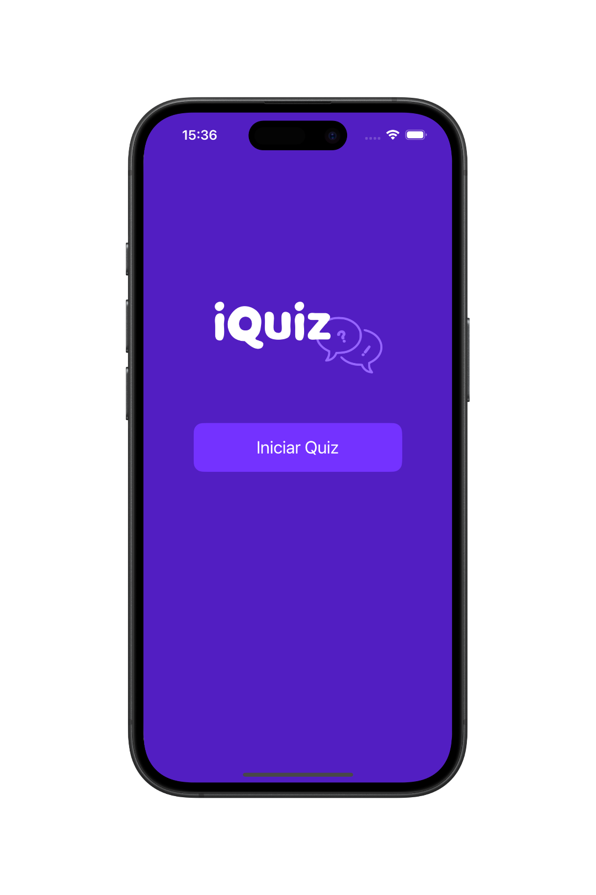
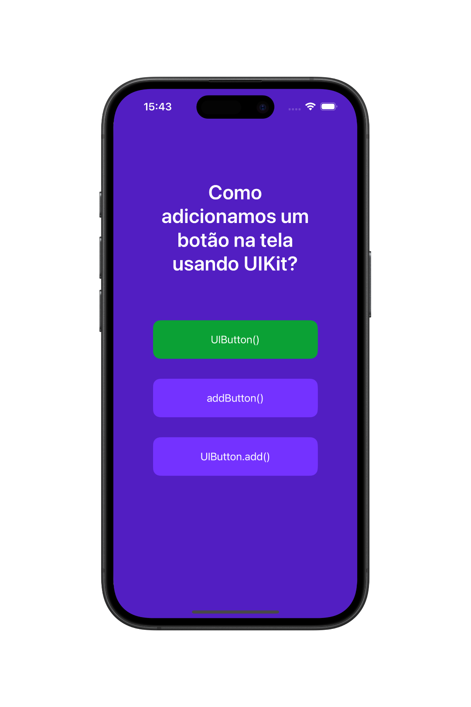
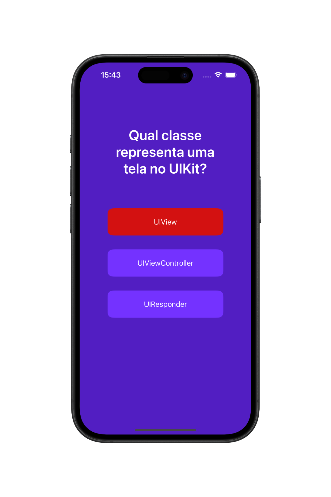
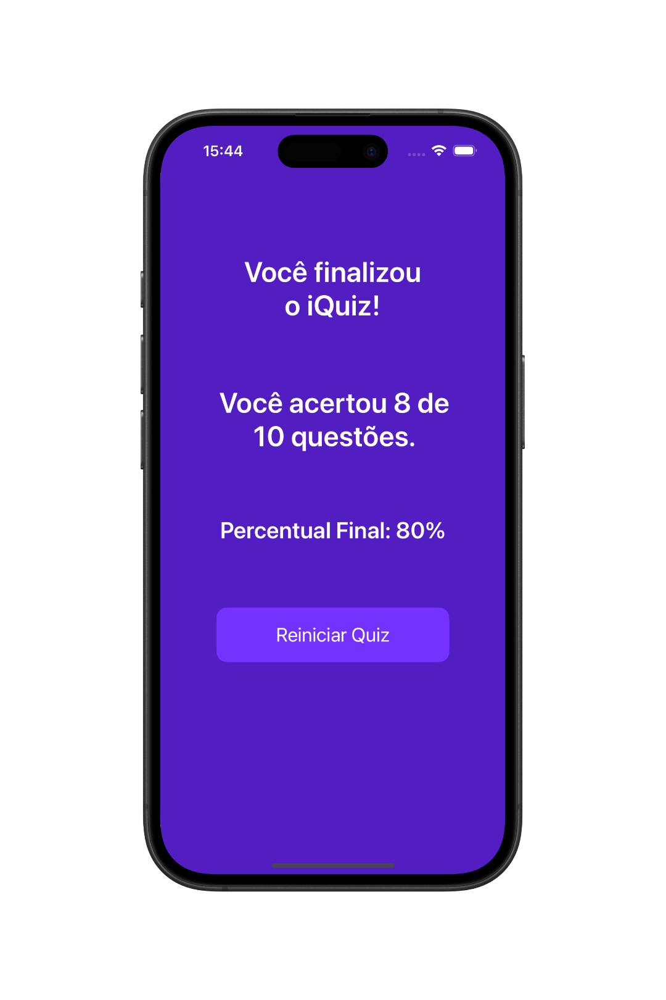

# 📱 iQuiz - App de Quiz

O **iQuiz** é um aplicativo educacional simples, desenvolvido com **UIKit (Storyboard)**, que testa seus conhecimentos sobre a **linguagem Swift** e **desenvolvimento de apps iOS** através de perguntas objetivas de múltipla escolha.

  
  
  
  

---

## 🛠 Tecnologias Utilizadas

- Swift  
- UIKit  
- Storyboard  
- Auto Layout  
- MVC (Model-View-Controller)  

---

## 👨🏻‍💻 Como Usar o Aplicativo

- Baixe o projeto e abra com o Xcode.
- Execute o aplicativo em um simulador iOS ou iPhone físico.
- Toque no botão **"Iniciar Quiz"**.
- Toque na resposta que você achar correta para cada pergunta e aguarde a próxima.
- Após responder as 10 perguntas, será exibida a tela de desempenho.
- Para refazer o quiz, toque no botão **"Reiniciar Quiz"**.

---

## 📌 Observação

Esse projeto tem fins educacionais e foi criado como exercício para praticar conceitos de desenvolvimento iOS com **UIKit** e **Storyboard**.
